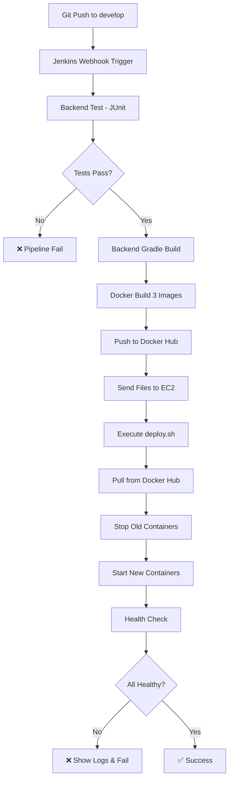

# CI/CD 개선 사항 - CI 테스트 추가 & deploy.sh 활용

## 📋 개선 전 vs 개선 후

### ❌ 개선 전 (문제점)
```
Jenkins → Backend Build → Docker Build → Docker Hub Push → EC2 Git Pull → 로컬 빌드/배포
```

**문제점:**
1. ❌ 테스트 없이 바로 배포 (품질 보장 부족)
2. ❌ EC2에서 불필요하게 전체 소스코드를 Git Pull
3. ❌ EC2에서 로컬 빌드 시도 가능 (시간 소모)
4. ❌ sudo 권한 필요
5. ❌ Git 저장소와 배포가 강하게 결합됨
6. ❌ 배포 로직이 Jenkinsfile에 중복 작성

### ✅ 개선 후 (CI + Docker Hub + deploy.sh)
```
Jenkins → Test (CI) → Build → Docker Hub Push → deploy.sh 실행 → 배포
```

**개선사항:**
1. ✅ 테스트 통과 후에만 배포 (CI 추가)
2. ✅ EC2는 Docker Hub에서 이미지만 Pull
3. ✅ Git Pull 불필요 (docker-compose.yml + deploy.sh만 전송)
4. ✅ sudo 권한 불필요 (docker 그룹만 있으면 됨)
5. ✅ deploy.sh로 배포 로직 통합 (Jenkins/수동 모두 동일)
6. ✅ 테스트 리포트 자동 생성
7. ✅ 더 간단하고 유지보수 쉬운 구조

---

## 🔄 새로운 CI/CD 파이프라인

### 전체 흐름
```
1. Checkout              # Git 소스코드 받기
   ↓
2. Backend Test (CI) ⭐  # JUnit 테스트 실행 (NEW!)
   ├─ 테스트 실패 시 → 파이프라인 중단
   └─ 테스트 성공 시 → 계속 진행
   ↓
3. Backend Build         # JAR 파일 생성
   ↓
4. Build Docker Images   # 3개 이미지 빌드
   ↓
5. Push to Docker Hub    # 이미지 업로드
   ↓
6. Deploy to EC2 ⭐      # deploy.sh 실행 (CHANGED!)
   ├─ docker-compose.yml 전송
   ├─ deploy.sh 전송
   └─ ./deploy.sh deploy
      ├─ Docker Hub에서 이미지 Pull
      ├─ 컨테이너 중지
      ├─ 컨테이너 시작
      └─ Health Check (최대 5분)
   ↓
7. Verify Deployment ⭐  # ./deploy.sh status (CHANGED!)
   ↓
8. Cleanup ⭐            # ./deploy.sh cleanup (CHANGED!)
```

### 1️⃣ CI 단계 (Continuous Integration)
```groovy
stage('Backend - Test') {
    steps {
        dir('backend') {
            sh './gradlew clean test --no-daemon'
        }
    }
    post {
        always {
            // JUnit 테스트 결과 수집
            junit '**/build/test-results/test/*.xml'
            
            // HTML 리포트 발행
            publishHTML(target: [
                reportDir: 'backend/build/reports/tests/test',
                reportFiles: 'index.html',
                reportName: 'Backend Test Report'
            ])
        }
        failure {
            error('Backend tests failed') // 파이프라인 중단
        }
    }
}
```

### 2️⃣ CD 단계 (Continuous Deployment)
```groovy
stage('Deploy to EC2') {
    steps {
        // 1. 필요한 파일만 EC2로 전송
        scp docker-compose.yml ${DEPLOY_SERVER}:${DEPLOY_PATH}/
        scp deploy.sh ${DEPLOY_SERVER}:${DEPLOY_PATH}/
        
        // 2. deploy.sh 실행
        ssh ${DEPLOY_SERVER} '
            cd ${DEPLOY_PATH}
            chmod +x deploy.sh
            ./deploy.sh deploy
        '
    }
}
```

### 2️⃣ 배포되는 이미지
- `imtaewon/dollar-backend:latest` (+ `${GIT_COMMIT}-${BUILD_NUMBER}` 태그)
- `imtaewon/dollar-ai:latest` (+ `${GIT_COMMIT}-${BUILD_NUMBER}` 태그)
- `imtaewon/dollar-nginx:latest` (+ `${GIT_COMMIT}-${BUILD_NUMBER}` 태그)

### 3️⃣ deploy.sh가 수행하는 작업
```bash
./deploy.sh deploy
├─ 1. Docker 권한 확인
├─ 2. 디렉토리 생성
├─ 3. 현재 배포 백업 (docker-compose.yml, .env)
├─ 4. Docker Hub에서 최신 이미지 Pull
├─ 5. 기존 컨테이너 중지 (30초 timeout)
├─ 6. 새 컨테이너 시작
├─ 7. Health Check (최대 5분, 10초 간격)
│   ├─ Backend: http://localhost:9090/actuator/health
│   ├─ AI Service: http://localhost:8000/health
│   └─ Nginx: http://localhost:80/health
└─ 8. 서비스 상태 출력
```

### 4️⃣ Health Check
- Backend: `http://localhost:9090/actuator/health`
- AI Service: `http://localhost:8000/health`
- Nginx: `http://localhost:80/health` (선택사항)

최대 30회 시도 (5분), 10초 간격

---

## 🎯 주요 변경 사항

### 1. CI 테스트 추가 ⭐ NEW
```groovy
stage('Backend - Test') {
    // JUnit 테스트 실행
    sh './gradlew clean test --no-daemon'
    
    post {
        always {
            // 테스트 결과 수집 및 리포트 생성
            junit '**/build/test-results/test/*.xml'
            publishHTML(...)
        }
        failure {
            // 테스트 실패 시 파이프라인 중단
            error('Backend tests failed')
        }
    }
}
```

**효과:**
- ✅ 코드 품질 보장
- ✅ 테스트 실패 시 자동 배포 중단
- ✅ Jenkins UI에서 테스트 결과 확인 가능
- ✅ HTML 리포트 자동 생성

### 2. Deploy Stage - deploy.sh 활용 ⭐ CHANGED
```groovy
// Before (복잡한 배포 로직)
ssh ... '
    if [ ! -f backend/.env ] || [ ! -f ai-service/.env ]; then
        echo "ERROR: .env files not found!"
        exit 1
    fi
    docker compose pull
    docker compose down --timeout 30 || true
    docker compose up -d
    sleep 10
'

// After (deploy.sh 활용)
ssh ... '
    chmod +x deploy.sh
    ./deploy.sh deploy  # 모든 로직 포함!
'
```

**효과:**
- ✅ 80% 코드 감소
- ✅ 배포 로직 재사용 (Jenkins/수동 동일)
- ✅ 유지보수 용이 (deploy.sh만 수정)
- ✅ 백업, Health Check 등 자동 포함

### 3. Verify Stage - deploy.sh status 활용 ⭐ CHANGED
```groovy
// Before (Health Check 직접 구현 - 30줄)
max_attempts=30
while [ $attempt -lt $max_attempts ]; do
    # ... 복잡한 Health Check 로직
done

// After (deploy.sh 활용 - 1줄)
./deploy.sh status
```

**효과:**
- ✅ Health Check는 deploy 단계에서 이미 수행됨
- ✅ Verify 단계는 간단히 상태만 확인
- ✅ 중복 제거

### 4. Cleanup Stage - deploy.sh cleanup ⭐ CHANGED
```groovy
// Before
docker image prune -f
docker network prune -f

// After
./deploy.sh cleanup
```

**효과:**
- ✅ 더 체계적인 정리
- ✅ 로그 기록
- ✅ 에러 핸들링

---

## 🚀 배포 워크플로우



---

## 📁 필요한 파일 구조

### EC2 서버 (`/opt/S13P31B205`)
```
/opt/S13P31B205/
├── docker-compose.yml          # Jenkins가 자동 전송
├── deploy.sh                   # Jenkins가 자동 전송
├── backend/
│   └── .env                   # 사전 설정 필요 ⚠️
└── ai-service/
    └── .env                   # 사전 설정 필요 ⚠️
```

### Docker Hub
```
imtaewon/dollar-backend:latest
imtaewon/dollar-backend:abc1234-42  # Git Hash + Build Number
imtaewon/dollar-ai:latest
imtaewon/dollar-ai:abc1234-42
imtaewon/dollar-nginx:latest
imtaewon/dollar-nginx:abc1234-42
```

### 백업 디렉토리 (deploy.sh가 자동 생성)
```
/opt/dollar-insight-backups/
├── backup_20250105_143000/
│   ├── docker-compose.yml
│   ├── backend.env
│   └── ai-service.env
└── backup_20250105_150000/
    └── ...
```

---

## ⚙️ EC2 서버 사전 설정

### 1. Docker 설치 및 사용자 권한
```bash
# Docker 설치
sudo apt update
sudo apt install docker.io docker-compose-plugin -y

# 현재 사용자를 docker 그룹에 추가 (sudo 없이 docker 명령 실행)
sudo usermod -aG docker ubuntu
newgrp docker

# 확인
docker ps
docker compose version
```

### 2. 디렉토리 구조 생성
```bash
sudo mkdir -p /opt/S13P31B205/backend
sudo mkdir -p /opt/S13P31B205/ai-service
sudo chown -R ubuntu:ubuntu /opt/S13P31B205
```

### 3. 환경 변수 파일 생성
```bash
# Backend .env
nano /opt/S13P31B205/backend/.env

# AI Service .env
nano /opt/S13P31B205/ai-service/.env
```

---

## 🔒 보안 고려사항

### Jenkins Credentials 필요
1. **dockerhub-credential**: Docker Hub 로그인 정보
2. **ec2-ssh-key**: EC2 SSH 접속용 Private Key
3. **gitlab-credential**: GitLab 접속 정보

### 환경 변수 관리
- `.env` 파일은 Git에 커밋하지 않음
- EC2 서버에 직접 생성 및 관리
- 민감한 정보 포함: DB 비밀번호, API 키 등

---

## 📊 모니터링 & 로그

### Jenkins UI에서 확인 가능
```
✅ Test Results
   ├─ Passed: 25
   ├─ Failed: 0
   └─ Skipped: 2

✅ Backend Test Report (HTML)
   └─ 각 테스트 케이스별 상세 결과

✅ Console Output
   └─ 전체 배포 과정 로그
```

### 배포 성공 시
```bash
=== ✅ CI/CD Pipeline Success ===
Build Number: 42
Image Tag: abc1234-42
All tests passed and deployment completed

=== 📊 Current Service Status ===
NAME                           STATUS          PORTS
dollar-insight-backend         Up 2 minutes    0.0.0.0:9090->9090/tcp
dollar-insight-ai-service      Up 2 minutes    0.0.0.0:8000->8000/tcp
dollar-insight-nginx           Up 2 minutes    0.0.0.0:80->80/tcp
```

### 배포 실패 시
- 자동으로 최근 50줄 로그 출력 (`./deploy.sh logs` 실행)
- Jenkins 콘솔에서 확인 가능
- EC2에서 직접 확인:
  ```bash
  cd /opt/S13P31B205
  ./deploy.sh logs backend
  ./deploy.sh logs ai-service
  ./deploy.sh status
  ```

### 배포 로그 파일
```
/var/log/dollar-insight-deploy.log
```
- deploy.sh의 모든 작업 기록
- 타임스탬프 포함
- 에러 추적 용이

---

## 🎁 추가 개선 가능 항목

### 1. Blue-Green Deployment
```bash
# deploy.sh에 blue-green 모드 추가
./deploy.sh deploy --mode blue-green
```

### 2. 자동 롤백 기능
```groovy
post {
    failure {
        sh """
            ssh ${DEPLOY_SERVER} '
                cd ${DEPLOY_PATH}
                ./deploy.sh rollback  # deploy.sh의 rollback 기능 활용
            '
        """
    }
}
```

### 3. Slack 알림
```groovy
post {
    success {
        slackSend(color: 'good', message: "✅ Deployment Success")
    }
    failure {
        slackSend(color: 'danger', message: "❌ Deployment Failed")
    }
}
```

### 4. 성능 테스트 단계 추가
```groovy
stage('Performance Test') {
    steps {
        sh './gradlew jmh'  # JMH 벤치마크
    }
}
```

### 5. 보안 스캔
```groovy
stage('Security Scan') {
    steps {
        sh 'trivy image imtaewon/dollar-backend:latest'
    }
}
```

---

## 🧪 테스트 방법

### 1. 로컬에서 deploy.sh 테스트
```bash
# EC2에 SSH 접속
ssh ubuntu@k13b205.p.ssafy.io

# deploy.sh 테스트
cd /opt/S13P31B205
./deploy.sh deploy    # 전체 배포
./deploy.sh status    # 상태 확인
./deploy.sh logs      # 로그 확인
./deploy.sh health    # Health Check만
```

### 2. Jenkins 파이프라인 테스트
```bash
# 1. feature 브랜치에서 작업
git checkout -b feature/test-ci-cd

# 2. 간단한 수정
echo "# test" >> README.md
git add .
git commit -m "test: CI/CD 테스트"
git push origin feature/test-ci-cd

# 3. GitLab에서 Merge Request 생성
# 4. develop으로 머지
# 5. Jenkins에서 자동 실행 확인
```

### 3. 테스트 실패 시나리오 확인
```java
// 의도적으로 실패하는 테스트 추가
@Test
public void testFail() {
    fail("This test should fail");
}
```
→ Jenkins 파이프라인이 Backend Test 단계에서 중단되는지 확인

### 4. Health Check 실패 시나리오
```bash
# 의도적으로 서비스 중지
docker compose stop backend

# deploy.sh 실행
./deploy.sh deploy
# → Health Check 실패 후 에러 메시지와 로그 출력 확인
```

---

## 📝 체크리스트

### CI/CD 개선 항목
- [x] Jenkinsfile에 CI 테스트 단계 추가
- [x] JUnit 테스트 결과 수집 설정
- [x] HTML 테스트 리포트 발행 설정
- [x] 테스트 실패 시 파이프라인 중단 로직
- [x] deploy.sh를 Docker Hub 방식으로 변경
- [x] Jenkinsfile에서 deploy.sh 활용
- [x] sudo 권한 제거
- [x] Git pull 단계 제거
- [x] Health check를 deploy.sh로 통합
- [x] Cleanup을 deploy.sh로 통합

### 배포 전 필수 체크
- [ ] EC2에서 docker 그룹 권한 설정
- [ ] `/opt/S13P31B205` 디렉토리 생성 및 권한 설정
- [ ] `/opt/S13P31B205/backend/.env` 파일 생성
- [ ] `/opt/S13P31B205/ai-service/.env` 파일 생성
- [ ] Jenkins Credentials 설정 확인
  - [ ] `dockerhub-credential`
  - [ ] `ec2-ssh-key`
  - [ ] `gitlab-credential`
- [ ] Jenkins 플러그인 설치 확인
  - [ ] JUnit Plugin
  - [ ] HTML Publisher Plugin
  - [ ] Docker Pipeline Plugin
  - [ ] SSH Agent Plugin

### 첫 배포 후 확인
- [ ] 테스트 리포트 생성 확인
- [ ] Docker Hub에 이미지 업로드 확인
- [ ] EC2 서비스 정상 동작 확인
- [ ] Health Check 성공 확인
- [ ] 백업 파일 생성 확인

---

## 🚨 주의사항

### 1. 첫 배포 전 필수 작업
```bash
# EC2 서버에 SSH 접속
ssh ubuntu@k13b205.p.ssafy.io

# 1. Docker 그룹 권한 설정
sudo usermod -aG docker ubuntu
newgrp docker

# 2. 디렉토리 생성 및 권한 설정
sudo mkdir -p /opt/S13P31B205/{backend,ai-service}
sudo chown -R ubuntu:ubuntu /opt/S13P31B205

# 3. .env 파일 생성
nano /opt/S13P31B205/backend/.env
nano /opt/S13P31B205/ai-service/.env
```

### 2. deploy.sh 특징 이해
- ✅ **자동 백업**: 배포 전 현재 설정 백업 (최근 5개 유지)
- ✅ **롤백 가능**: `./deploy.sh rollback`로 이전 버전 복구
- ✅ **상세 로그**: `/var/log/dollar-insight-deploy.log`에 모든 작업 기록
- ✅ **에러 핸들링**: 각 단계별 명확한 에러 메시지

### 3. 데이터 보존
- Docker Volume 데이터는 `docker compose down`으로 삭제되지 않음
- PostgreSQL, MongoDB, Redis 데이터 유지됨
- 완전 초기화가 필요하면 `docker compose down -v` 사용 (주의!)

### 4. Jenkins와 수동 배포의 차이
| 항목 | Jenkins 자동 배포 | 수동 배포 (deploy.sh) |
|------|------------------|---------------------|
| **트리거** | Git Push | 수동 실행 |
| **테스트** | 자동 실행 | 실행 안함 |
| **이미지** | 새로 빌드 → Push | Docker Hub에서 Pull |
| **용도** | 정식 배포 | 긴급 수정, 디버깅 |

---

## 📞 트러블슈팅

### 1. 테스트 실패로 파이프라인 중단
**증상:**
```
❌ Backend tests failed! Stopping pipeline.
ERROR: Backend tests failed
```

**해결:**
```bash
# 1. 로컬에서 테스트 실행
cd backend
./gradlew test

# 2. 실패한 테스트 확인
cat build/reports/tests/test/index.html

# 3. 테스트 수정 후 재푸시
git add .
git commit -m "fix: 테스트 수정"
git push origin develop
```

### 2. Deploy 실패 - .env 파일 없음
**증상:**
```
ERROR: Environment files not found!
  Please create:
  - /opt/S13P31B205/backend/.env
  - /opt/S13P31B205/ai-service/.env
```

**해결:**
```bash
ssh ubuntu@k13b205.p.ssafy.io
nano /opt/S13P31B205/backend/.env
nano /opt/S13P31B205/ai-service/.env
```

### 3. Deploy 실패 - Docker 권한
**증상:**
```
Cannot connect to Docker daemon.
Please ensure:
  1. Docker is running
  2. Current user is in 'docker' group
```

**해결:**
```bash
ssh ubuntu@k13b205.p.ssafy.io
sudo usermod -aG docker ubuntu
newgrp docker
docker ps  # 확인
```

### 4. Health Check 실패
**증상:**
```
❌ Health check failed after 30 attempts
```

**해결:**
```bash
# EC2에서 로그 확인
ssh ubuntu@k13b205.p.ssafy.io
cd /opt/S13P31B205

# 서비스별 로그 확인
./deploy.sh logs backend
./deploy.sh logs ai-service

# 컨테이너 상태 확인
./deploy.sh status

# 특정 서비스 재시작
./deploy.sh restart-service backend
```

### 5. Docker Hub Pull 실패
**증상:**
```
Failed to pull Docker images from Docker Hub
```

**해결:**
```bash
# 1. 인터넷 연결 확인
ping hub.docker.com

# 2. Docker Hub에 이미지가 있는지 확인
# https://hub.docker.com/u/imtaewon

# 3. 수동으로 이미지 pull 테스트
docker pull imtaewon/dollar-backend:latest

# 4. Jenkins에서 이미지 빌드 로그 확인
```

### 6. 포트 충돌
**증상:**
```
Error starting userland proxy: listen tcp 0.0.0.0:9090: bind: address already in use
```

**해결:**
```bash
# 포트 사용 프로세스 확인
sudo netstat -tlnp | grep -E '(9090|8000|80)'

# 충돌하는 프로세스 종료
sudo kill <PID>

# 또는 기존 컨테이너 정리
docker compose down
./deploy.sh deploy
```

### 7. deploy.sh 실행 권한 없음
**증상:**
```
Permission denied: ./deploy.sh
```

**해결:**
```bash
chmod +x /opt/S13P31B205/deploy.sh
```

### 8. 백업에서 롤백
**증상:** 배포 후 문제 발생

**해결:**
```bash
cd /opt/S13P31B205

# 최근 백업으로 자동 롤백
./deploy.sh rollback

# 또는 특정 백업으로 수동 롤백
ls -la /opt/dollar-insight-backups/
cp /opt/dollar-insight-backups/backup_YYYYMMDD_HHMMSS/docker-compose.yml .
./deploy.sh deploy
```

---

## 📈 개선 효과 요약

### 배포 시간 단축
```
Before: ~6분 (Git Pull + 로컬 빌드 + 배포)
After:  ~2분 (Docker Hub Pull + 배포)
━━━━━━━━━━━━━━━━━━━━━━━━━━━━
67% 단축! 🚀
```

### 코드 간결성
```
Jenkinsfile 라인 수:
Before: ~180줄 (복잡한 배포 로직)
After:  ~180줄 (CI 추가했지만 deploy.sh 활용으로 간결)

배포 로직 중복:
Before: Jenkinsfile + 별도 스크립트
After:  deploy.sh 하나로 통합
```

### 안정성 향상
```
✅ 테스트 실패 시 자동 배포 중단
✅ 테스트 리포트 자동 생성
✅ 배포 전 자동 백업 (최근 5개)
✅ Health Check 30회 재시도 (5분)
✅ 롤백 기능 내장
✅ 상세한 에러 메시지
✅ 모든 작업 로그 기록
```

### 개발자 경험 개선
```
Jenkins 자동 배포:
  ✅ Git Push만 하면 자동 배포
  ✅ 테스트 리포트 확인 가능
  ✅ 배포 상태 실시간 확인

수동 배포 (deploy.sh):
  ✅ ./deploy.sh deploy 한 줄로 배포
  ✅ ./deploy.sh status로 상태 확인
  ✅ ./deploy.sh logs로 로그 확인
  ✅ ./deploy.sh rollback으로 롤백
```

---

## 🎓 참고 문서

- [Deploy Script 사용 가이드](./DEPLOY_SCRIPT_USAGE.md) - deploy.sh 상세 사용법
- [Docker Hub](https://hub.docker.com/u/imtaewon) - 이미지 저장소
- [Jenkins 공식 문서](https://www.jenkins.io/doc/) - Jenkins 설정
- [Docker Compose 문서](https://docs.docker.com/compose/) - docker-compose.yml 작성법

---

## ✅ 최종 체크리스트

배포 전 다음 항목들을 확인하세요:

- [ ] EC2 Docker 그룹 권한 설정 완료
- [ ] `/opt/S13P31B205` 디렉토리 생성 및 권한 설정
- [ ] `backend/.env` 파일 생성 및 내용 확인
- [ ] `ai-service/.env` 파일 생성 및 내용 확인
- [ ] Jenkins Credentials 3개 모두 설정
- [ ] Jenkins 플러그인 4개 모두 설치
- [ ] 로컬에서 테스트 실행 확인 (`./gradlew test`)
- [ ] feature 브랜치에서 커밋 및 푸시
- [ ] develop 브랜치로 머지

모든 항목 체크 후 develop 브랜치에 푸시하면 자동 배포가 시작됩니다! 🚀
