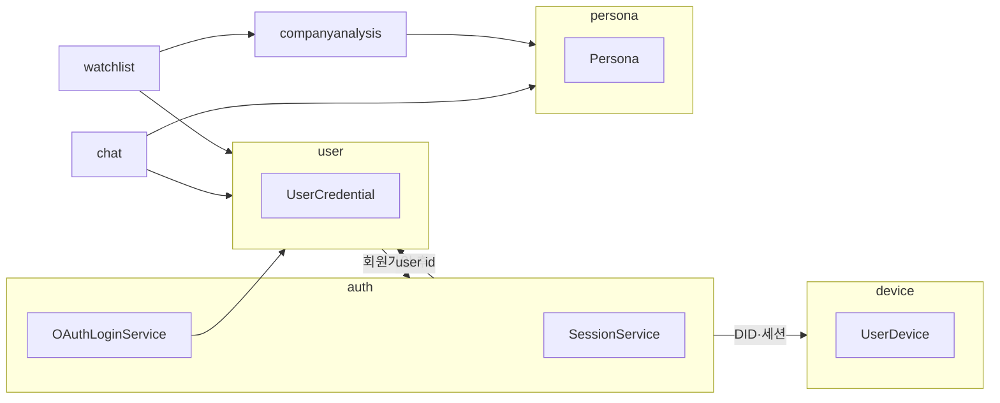

# 전략적 설계: 바운디드 컨텍스트와 관계

## DDD에서의 전략적 설계

전략적 설계는 **큰 문제를 나누는 경계**를 정하는 일입니다. 팀이 같은 용어(유비쿼터스 언어)로 소통할 수 있는 범위를 **바운디드 컨텍스트(BC)** 로 묶고, BC 간에는 번역·연동 규칙을 둡니다.

## 본 프로젝트의 바운디드 컨텍스트

| BC | 패키지 루트 | 책임 요약 |
|----|-------------|-----------|
| **user** | `com.ssafy.b205.backend.user` | 회원·자격증명·OAuth 계정·프로필(닉네임·비밀번호·탈퇴) |
| **auth** | `com.ssafy.b205.backend.auth` | 액세스/리프레시 세션, 토큰 재발급, 로그아웃, OAuth 코드 교환 보조 |
| **session (논리)** | `com.ssafy.b205.backend.auth.domain.session` | 리프레시·세션 엔티티·저장소 — **인증 BC에 귀속** |
| **device** | `com.ssafy.b205.backend.device` | 사용자별 기기 등록, 푸시 설정, DID 정규화와 연동 |
| **persona** | `com.ssafy.b205.backend.persona` | 투자 페르소나 마스터·사용자-페르소나 매핑 조회 |
| **watchlist** | `com.ssafy.b205.backend.watchlist` | 관심 종목 CRUD 및 표시용 메타(가격 등) 조합 |
| **chat** | `com.ssafy.b205.backend.chat` | 채팅 세션·메시지·SSE 스트림·히스토리 |
| **companyanalysis** | `com.ssafy.b205.backend.companyanalysis` | 대시보드·검색·종목/ETF 상세·뉴스 — FastAI·Mongo·DB 조회 조합 |
| **common** | `com.ssafy.b205.backend.common` | 공개 핑, 개발용 토큰 등 횡단 API |

## 컨텍스트 맵(개념)

### 관계 설명

- **user ↔ auth**: 이메일 가입·로그인은 `User` 생성 후 `SessionService`로 리프레시 저장. 소셜 로그인은 `OAuthLoginService`가 사용자 조회/생성 후 토큰 발급.
- **auth ↔ session (JPA)**: `UserSession`은 `auth.domain.session`에 두어 **토큰·세션 수명**을 인증 BC로 묶음.
- **auth ↔ device**: 세션·기기는 `UserDevice`와 연계(헤더 `X-Device-Id` 정규화).
- **chat ↔ user, persona**: 세션은 사용자 소유, 페르소나는 마스터/참여 정보로 조회.
- **watchlist ↔ companyanalysis**: 티커 검증·시세·메타는 분석 BC의 쿼리/리포지토리를 사용.

## 공유 커널에 가까운 모듈

- **`config`**: Spring 설정(JPA, Mongo, OpenAPI 등).
- **`support`**: 예외, 검증, 공통 응답 래퍼, JPA Auditing 베이스.
- **`infra`**: 보안 필터·JWT, 외부 HTTP 클라이언트(Kakao/Google/FastAI), Mongo DAO, SSE — **기술적 어댑터**로 BC 경계 밖에 둠.

이들은 “도메인 규칙”이라기보다 **플랫폼 공통**에 가깝고, BC는 이들을 **의존**하지만 반대로 `infra`가 특정 유스케이스만 알게 두지 않도록 유지합니다.

## 안티코럽션 레이어(ACL)

외부 OAuth·FastAI 응답 형식은 `infra.client.*` DTO로 받고, 애플리케이션 서비스에서 도메인/응답 DTO로 변환합니다. 클라이언트 SDK 형식이 바뀌어도 BC 내부 용어는 유지할 수 있습니다.
