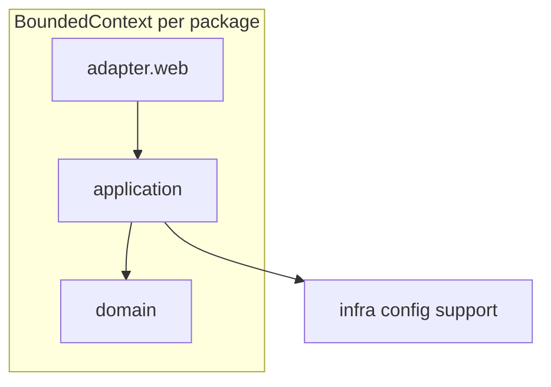

# 백엔드 DDD 준수 여부 평가

이 문서는 Dollar Insight Spring Boot 백엔드가 **도메인 주도 설계(DDD)** 관점에서 어떻게 정렬되어 있는지 요약합니다. 전략적 설계·패키지 구조는 [01-strategic-design.md](01-strategic-design.md), [02-tactical-patterns.md](02-tactical-patterns.md), [03-package-and-layers.md](03-package-and-layers.md)와 함께 읽는 것을 권장합니다.

## 결론

**“DDD를 지키고 있다”고 말할 수 있는 수준**입니다. 다만 학술적·엄격한 DDD(애그리거트 불변식 강제, 도메인 이벤트 전파, 배포 단위별 BC 분리)까지 **완전 준수**라고 보기는 어렵고, 팀이 본 디렉터리 문서에 밝힌 것처럼 **전략적 설계 + 실용적 전술 패턴**에 가깝습니다.

---

## 잘 맞는 부분 (전략·구조)

| DDD 개념 | 프로젝트 반영 |
|----------|----------------|
| **바운디드 컨텍스트** | `user`, `auth`, `device`, `persona`, `watchlist`, `chat`, `companyanalysis` 등 패키지 단위로 책임이 나뉘고, [01-strategic-design.md](01-strategic-design.md)에 컨텍스트 맵·관계가 문서화됨 |
| **레이어링** | BC별 `adapter.web` → `application` → `domain` 구조가 [03-package-and-layers.md](03-package-and-layers.md)와 실제 트리에 일치 |
| **애플리케이션 서비스** | 유스케이스 오케스트레이션·`@Transactional` 경계가 `*Service` / `*ApplicationService`에 모임 ([02-tactical-patterns.md](02-tactical-patterns.md)) |
| **리포지토리 = 포트** | 도메인 패키지의 `repository` 인터페이스 + Spring Data 구현 — 헥사고날/DDD에서 흔한 패턴 |
| **인프라 분리** | `infra.*`에 JWT, 필터, Mongo, 외부 HTTP 클라이언트를 두고 BC는 기술 세부에 덜 묶이도록 설계했다고 문서화 |
| **ACL** | OAuth/FastAI 응답을 `infra.client.*` DTO로 받아 애플리케이션에서 변환한다는 [01-strategic-design.md](01-strategic-design.md) 서술 |

---

## 완화되었거나 “순수 DDD”와 거리가 있는 부분

1. **애그리거트**  
   [02-tactical-patterns.md](02-tactical-patterns.md)에 **“엄격한 애그리거트 루트만 강제하지는 않았다”**고 명시되어 있습니다. 일관성 경계는 유스케이스·트랜잭션으로 묶는 수준입니다.

2. **도메인 모델의 “풍부함”**  
   일부 엔티티는 행위 메서드를 둡니다(예: [`UserDevice`](../../backend/src/main/java/com/ssafy/b205/backend/device/domain/entity/UserDevice.java)의 `updatePush`, [`User`](../../backend/src/main/java/com/ssafy/b205/backend/user/domain/entity/User.java)의 `updateNickname`). 동시에 Lombok `@Builder` 등으로 **상태 노출·세터 성격**이 강한 엔티티도 있어 **전형적인 애너믹 도메인 모델에 가까운 구간**이 있을 수 있습니다(문서도 “대부분 엔티티 + 애플리케이션 서비스”라고 함).

3. **BC 간 결합**  
   JPA `@ManyToOne` 등으로 **다른 BC의 엔티티를 직접 참조**하는 경우가 있습니다(예: `UserDevice` → `User`). 문서는 “다른 BC 엔티티 직접 참조 최소화” 수준 — **모듈러 모놀리스에서 흔한 타협**이며, 이벤트/ID만 참조하는 엄격한 BC 분리는 아닙니다.

4. **애플리케이션이 인프라 유틸에 직접 의존**  
   예: [`DeviceServiceImpl`](../../backend/src/main/java/com/ssafy/b205/backend/device/application/DeviceServiceImpl.java)이 `infra.security.DeviceIdResolver.normalize`를 정적 호출합니다. 실무에서는 흔하지만, **순수 의존성 역전** 관점에서는 포트(인터페이스)로 숨기는 편이 더 “DDD스럽다”고 평가될 수 있습니다.

5. **`companyanalysis`**  
   대시보드·검색·Mongo 조합 등 **조회/집계 중심**이면 애플리케이션 서비스가 **도메인 규칙보다 쿼리 조합**에 무게를 둘 가능성이 큽니다 — CQRS/읽기 모델에 가깝게 보는 것이 자연스러운 영역입니다.

---

## 한 줄 요약

- **의도와 구조**: DDD(특히 **전략적 설계 + 레이어드 헥사고날**)를 **의식적으로 따르고**, 문서([README.md](README.md))와 코드가 대체로 일치합니다.
- **엄격한 DDD**: 아님 — 애그리거트·도메인 이벤트·BC 간 완전한 결합 제거까지는 가지 않은 **실용적 DDD 스타일**로 보는 것이 정확합니다.

---

## 개선 시 참고할 수 있는 우선순위

코드 리뷰 기준으로 더 DDD에 가깝게 다듬고 싶다면 다음을 순서대로 검토할 수 있습니다.

1. 애그리거트 경계와 불변식을 코드·문서에 명시한다.
2. BC 간 참조를 ID·이벤트 기반으로 줄인다.
3. 읽기 전용 유스케이스와 쓰기 모델 분리(CQRS 등)를 검토한다.
