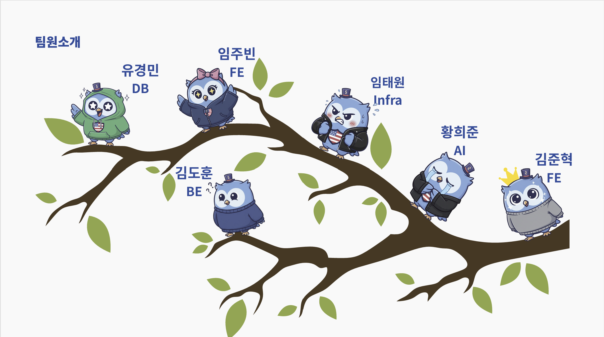

# DollarIn$ight 📈

> AI-powered US Stock Analysis Platform for Korean Investors

## 🎯 프로젝트 개요

DollarInsight는 한국 투자자들을 위한 AI 기반 미국 주식 분석 플랫폼입니다. 다양한 AI 페르소나(가치투자자, 기술적 분석가, 뉴스 분석가 등)와의 그룹 채팅을 통해 개인화된 투자 인사이트를 제공합니다.

- **팀**: SSAFY 13기 자율프로젝트 B205팀
- **개발 기간**: 2024.10 ~ 2024.11
- **서비스 URL**: https://k13b205.p.ssafy.io

## ✨ 주요 기능

### 💬 AI 페르소나 채팅
- **다중 페르소나 시스템**: 가치투자자, 기술적 분석가, 뉴스 분석가 등 5가지 AI 페르소나
- **실시간 그룹 채팅**: SSE를 통한 실시간 스트리밍 응답
- **맞춤형 분석**: 사용자 질문에 대한 개인화된 투자 조언

### 📊 종합 투자 분석
- **실시간 주가 정보**: 미국 주식 및 ETF 실시간 가격 데이터
- **AI 주가 예측**: 1주, 1개월 단위 주가 예측 모델
- **투자 지표 분석**: PER, PBR, ROE 등 핵심 투자 지표
- **위험도 평가**: 모멘텀, 밸류에이션, 성장성 기반 종합 점수

### 📰 뉴스 & 인사이트
- **실시간 뉴스**: Investing.com 기반 최신 금융 뉴스
- **페르소나별 해석**: 각 뉴스에 대한 다양한 관점의 분석
- **데일리 픽**: AI가 선별한 일일 추천 종목

### 🔍 종목 관리
- **관심종목**: 개인별 포트폴리오 관리
- **종목 검색**: 티커, 회사명 기반 통합 검색
- **상세 분석**: 기업별 종합 분석 리포트

## 🏗 시스템 아키텍처


### 기술 스택

#### Frontend
- **Flutter**: 크로스 플랫폼 모바일 앱
- **Dart**: 개발 언어
- **Provider**: 상태 관리

#### Backend
- **Spring Boot**: RESTful API 서버
- **Spring Security**: 인증/인가 (JWT)
- **JPA/Hibernate**: ORM
- **FastAPI**: AI 서비스 API

#### Database
- **PostgreSQL**: 사용자, 인증, 관심종목 데이터
- **MongoDB**: 채팅 메시지, 뉴스 데이터
- **ChromaDB**: 벡터 임베딩, 유사도 검색

#### Infrastructure
- **AWS EC2**: 서버 호스팅
- **Docker & Docker Compose**: 컨테이너화
- **Jenkins**: CI/CD 파이프라인
- **Nginx**: 리버스 프록시, SSL 터미네이션
- **Let's Encrypt**: SSL 인증서


## 🛠️ 주요 사용 기술

### 실시간 SSE 통신

  

DollarInsight는 **3계층 SSE(Server-Sent Events) 스트리밍**으로 AI 토론 내용을 실시간 전달합니다:

```
Flutter (EventSource) ⇄ Spring Boot (중계) ⇄ FastAPI (AI 토론)
```

**핵심 기능**:
- **실시간 스트리밍**: AI 토론이 생성되는 즉시 사용자에게 전달
- **안정적 중계**: Spring Boot가 인증·세션 관리 및 MongoDB 저장 담당
- **재연결 보장**: Last-Event-ID 기반 누락 메시지 자동 복구
- **다중 디바이스**: Device ID 기반 독립적인 스트림 관리

## 🚀 빠른 시작

### 사전 요구사항
- Docker & Docker Compose
- Node.js 18+
- Flutter SDK
- Java 17+
- Python 3.9+

### 로컬 개발 환경 설정

1. **저장소 클론**
```bash
git clone https://lab.ssafy.com/s13-final/S13P31B205.git
cd S13P31B205
```

2. **환경 변수 설정**
```bash
# 루트 환경 변수
cp .env.template .env

# 백엔드 환경 변수
cp backend/.env.template backend/.env

# AI 서비스 환경 변수
cp ai-service/.env.template ai-service/.env

# Flutter 환경 변수
cp frontend/.env.template frontend/.env

# 각 .env 파일을 열어 your-* 플레이스홀더를 실제 값으로 교체
# 상세한 설정 방법은 ENV_SETUP_GUIDE.md 참조
```

3. **Docker 서비스 실행**
```bash
# 데이터베이스 및 인프라 서비스 실행
docker-compose up -d postgres mongodb redis chromadb

# 백엔드 서비스 실행
docker-compose up -d backend ai-service

# nginx 프록시 실행
docker-compose up -d nginx
```

4. **Flutter 앱 실행**
```bash
cd frontend
flutter pub get
flutter run
```

### 개발용 토큰 발급 (로컬만)
```bash
curl -X POST "http://localhost:8080/api/public/dev/token" \
  -H "X-Device-Id: dev-device-001" \
  -H "Content-Type: application/json"
```

## 🔐 인증 & 보안

### 인증 방식
- **JWT 토큰**: Access Token + Refresh Token
- **디바이스 바인딩**: X-Device-Id 헤더 필수
- **OAuth 지원**: Google, Kakao 소셜 로그인

### 보안 기능
- **HTTPS**: Let's Encrypt SSL 인증서
- **CORS**: 크로스 오리진 요청 제한
- **Rate Limiting**: API 호출 제한
- **Input Validation**: 요청 데이터 검증
- **환경 변수 보호**: `.env` 파일 Git 제외, 템플릿만 관리

### 📚 보안 참고 문서 (선택사항)
> **Note**: SSAFY 프로젝트는 교육/시연 목적이므로 아래 문서들은 **참고용**입니다.
> 실제 상용 서비스 운영 시 적용할 수 있는 모범 사례를 담고 있습니다.

- **[ENV_SETUP_GUIDE.md](ENV_SETUP_GUIDE.md)**: 환경 변수 설정 가이드
- **[SECURITY_DEPLOYMENT_GUIDE.md](SECURITY_DEPLOYMENT_GUIDE.md)**: Production 보안 배포 가이드
- **[nginx/conf.d/server-production.conf](nginx/conf.d/server-production.conf)**: Production용 Nginx 설정 예시
- **[nginx/PRODUCTION_SECURITY.md](nginx/PRODUCTION_SECURITY.md)**: Nginx 보안 상세 가이드

**현재 프로젝트는 개발 설정(`server.conf`)을 사용하며, Swagger UI와 Admin Tools에 접근 가능합니다.**

## 🛠 배포 & 운영

### 배포 방법 (deploy.sh 사용 - 권장)

프로젝트는 `deploy.sh` 스크립트를 통해 간편하게 배포할 수 있습니다.

#### 주요 배포 명령어

```bash
# 서버 접속
ssh ubuntu@k13b205.p.ssafy.io
cd /opt/S13P31B205

# 애플리케이션 배포 (Backend + AI Service + Airflow)
./deploy.sh deploy

# Flutter APK 빌드 및 배포
./deploy.sh build-and-deploy-apk

# 서비스 상태 확인
./deploy.sh status

# 로그 확인
./deploy.sh logs backend
./deploy.sh logs ai-service

# 특정 서비스 재시작
./deploy.sh restart-service backend

# Health Check
./deploy.sh health
```

#### deploy.sh 주요 기능

- ✅ **자동 백업**: 배포 전 자동 백업 (최대 5개 유지)
- ✅ **이미지 Pull**: Docker Hub에서 최신 이미지 자동 다운로드
- ✅ **무중단 재시작**: DB, Nginx는 유지하고 앱만 재시작
- ✅ **Health Check**: 배포 후 자동 상태 확인
- ✅ **Rollback**: 문제 발생 시 이전 버전으로 복구 가능

상세한 사용법은 [deploy.sh](deploy.sh) 파일 참조

### CI/CD 파이프라인
1. **Git Push** → GitLab Repository
2. **Webhook** → Jenkins Pipeline
3. **Build & Test** → Docker Image Build
4. **Push** → Docker Hub Registry
5. **Deploy** → `deploy.sh deploy` 실행 (AWS EC2)
6. **Health Check** → Service Monitoring

### 모니터링
- **Container Logs**: `./deploy.sh logs [service]`
- **Nginx Logs**: 액세스 로그 분석
- **Application Metrics**: Spring Boot Actuator
- **Database Monitoring**: PostgreSQL/MongoDB 상태 체크
- **Resource Usage**: `./deploy.sh status`

### 백업 전략
- **자동 백업**: `deploy.sh`가 배포 시 자동으로 백업 생성
- **최대 보관**: 최근 5개 백업 유지
- **Rollback**: `./deploy.sh rollback`으로 복구 가능
- **Volume Data**: Docker named volume 보존
- **Configuration**: Git repository 관리

## 🤝 팀 구성



| 역할 | 담당자 | 주요 업무 |
|------|--------|-----------|
| **Team Leader & Frontend** | 김준혁 | Flutter 앱 개발, UI/UX 설계 |
| **Backend** | 김도훈 | Spring Boot API, 데이터베이스 설계 |
| **AI Service** | 황희준 | FastAPI 개발, AI 모델 통합 |
| **Frontend** | 임주빈 | Flutter 개발, 사용자 인터페이스 |
| **PM & Data** | 유경민 | 데이터 파이프라인, 백엔드 지원 |
| **Frontend & Infrastructure** | 임태원 | 인프라 구축, CI/CD, 모니터링, Flutter 개발 |

## 📂 프로젝트 구조

```
S13P31B205/
├── frontend/                  # Flutter 모바일 앱
│   ├── lib/
│   ├── android/
│   ├── ios/
│   ├── .env.template         # Flutter 환경 변수 템플릿
│   └── pubspec.yaml
├── backend/                   # Spring Boot 백엔드
│   ├── src/main/java/
│   ├── src/main/resources/
│   ├── .env.template         # Backend 환경 변수 템플릿
│   ├── Dockerfile
│   └── build.gradle
├── ai-service/               # FastAPI AI 서비스
│   ├── app/
│   ├── .env.template         # AI Service 환경 변수 템플릿
│   ├── requirements.txt
│   └── Dockerfile
├── nginx/                    # Nginx 설정
│   ├── conf.d/
│   │   ├── server.conf       # 현재 사용 중 (개발/시연용)
│   │   ├── server-production.conf  # Production 참고용
│   │   └── security.conf
│   ├── PRODUCTION_SECURITY.md  # Nginx 보안 가이드 (참고용)
│   └── ssl/
├── docker-compose.yml        # 개발 환경 구성
├── deploy.sh                 # 배포 스크립트
├── .env.template            # 환경 변수 템플릿 (루트)
├── .gitignore               # Git 제외 파일 목록
├── check-env.sh             # 환경 변수 검증 스크립트
├── test-security.sh         # 보안 설정 테스트 스크립트
├── ENV_SETUP_GUIDE.md       # 환경 변수 설정 가이드
├── SECURITY_DEPLOYMENT_GUIDE.md  # 보안 배포 가이드 (참고용)
└── README.md                # 프로젝트 문서
```

## 🐛 트러블슈팅

### 일반적인 문제들

**1. Docker 컨테이너 네트워킹 이슈**
```bash
# 컨테이너 네트워크 확인
docker network ls
docker network inspect s13p31b205_default

# 컨테이너 간 통신 테스트
docker exec backend ping postgres
```

**2. Jenkins 빌드 실패**
```bash
# Jenkins 로그 확인
docker logs jenkins

# 권한 문제 해결
sudo chown -R jenkins:jenkins /var/jenkins_home
```

**3. SSL 인증서 갱신**
```bash
# Let's Encrypt 인증서 갱신
sudo certbot renew --nginx
```

**4. 데이터베이스 연결 문제**
```bash
# PostgreSQL 연결 상태 확인
docker exec postgres pg_isready -U dollarinsight

# MongoDB 연결 확인
docker exec mongodb mongosh --eval "db.adminCommand('ping')"
```


## 📄 라이선스

이 프로젝트는 SSAFY(삼성 청년 SW 아카데미) 교육 목적으로 개발되었습니다.

## 📞 연락처

- **프로젝트**: SSAFY 13기 B205 자율프로젝트
- **Git Repository**: https://lab.ssafy.com/s13-final/S13P31B205
- **서비스 URL**: https://k13b205.p.ssafy.io

---

*Made with ❤️ by Team B205*
